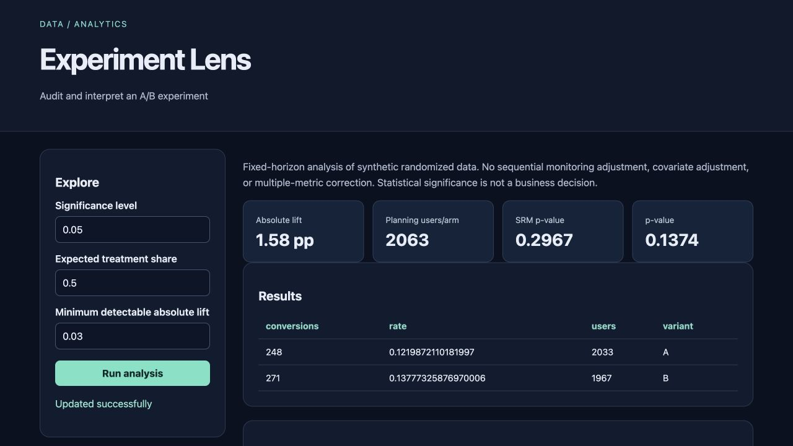

# Experiment Lens

Audit and interpret an A/B experiment for **product analysts**.

Original topic: **A/B Testing Statistical Analysis** from [the source post](https://www.instagram.com/p/DdyMaogE4ud/).

> Local portfolio implementation developed with Codex assistance. Measured results and limitations are documented; no production adoption, revenue or hiring outcome is claimed.



## What works

- SRM checks
- intervals
- lift
- power
- stopping caveats

[Example output](reports/example-output.json) · [Recorded checks](reports/test-results.txt) · [Learning and interview guide](LEARNING_GUIDE.md)

## Start

Python 3.12 is the validated Python runtime. Run commands from this repository directory. Windows users activate `.venv\Scripts\activate` instead of `source`.

```sh
python3.12 -m venv .venv
source .venv/bin/activate
python -m pip install -r requirements.txt
python generate.py
python app.py
```

Open **http://127.0.0.1:8080**. Keep the process running. Set `PORT` to use another port (Retention Studio uses `--port`). The Python development servers are intended for local demonstrations.

## Demonstration

Inspect the synthetic experiment, then change expected treatment allocation to trigger an SRM warning. Compare the effect interval with zero and inspect the planning sample size for a chosen minimum effect.

## Architecture and decisions

Browser controls → validated Flask API → project analysis/workflow → results and export.

Stack: scipy · Flask.

1. Validate unique randomized user IDs and binary outcomes before computing effects.
2. Report absolute/relative lift, rate intervals, a fixed-horizon test and sample-ratio mismatch separately.
3. Expose allocation and planning assumptions; keep statistical evidence distinct from a shipping decision.

## Verification

```sh
python -m pytest -q
```

See [VERIFICATION.md](VERIFICATION.md) for actual executed checks, setup verification, model/data results and any outstanding environment limitations. A workflow file alone is not evidence that CI passed.

## Data and attribution

Seeded randomized synthetic experiment. See [DATA_AND_SOURCES.md](DATA_AND_SOURCES.md) for provenance and usage notes. Original project code is MIT unless a preserved source file or dependency states otherwise. Model and third-party data licenses remain separate.

## Limitations and next improvement

Synthetic fixed-window experiment. Normal approximations can fail for sparse events. No sequential peeking correction, multiple testing adjustment, interference analysis or guardrail metric. Sample-size calculation is an equal-group planning approximation.

Suggested extension: Add Fisher's exact test for sparse outcomes and compare it with the normal approximation.

## Honest portfolio use

This implementation and documentation were developed with substantial Codex assistance. Before presenting it, run the demonstration, explain the design choices, and complete the suggested independent modification. Do not describe generated code as work experience, an accepted upstream contribution, or a deployed production service.
